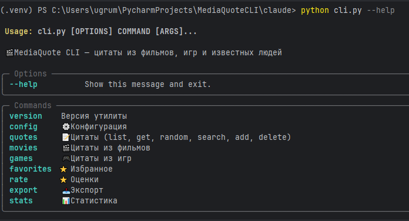
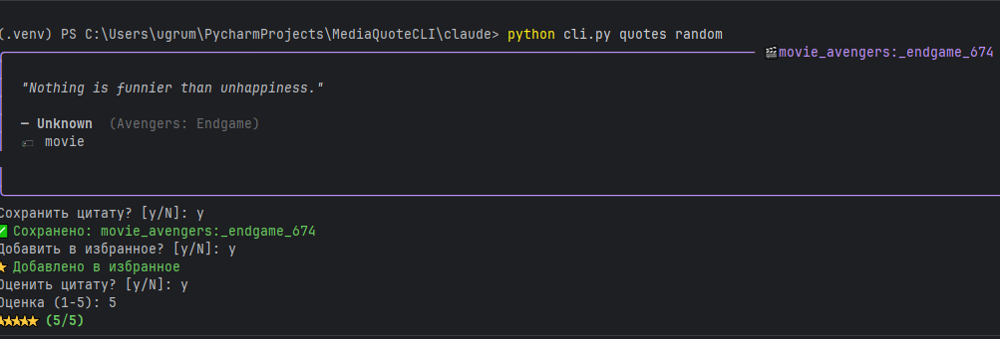
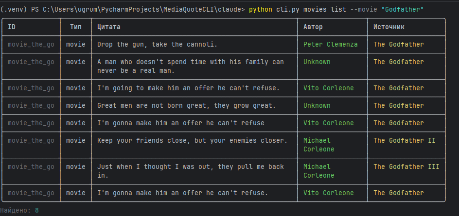
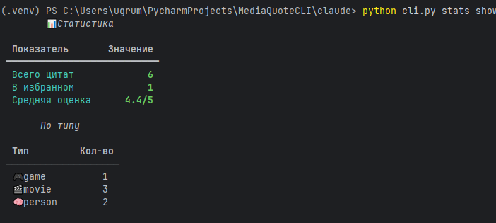
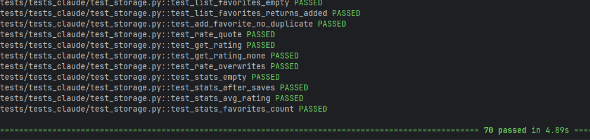
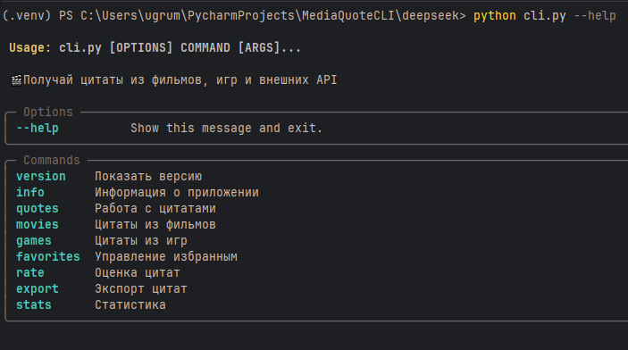
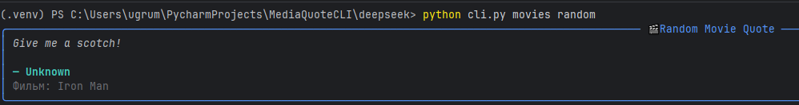
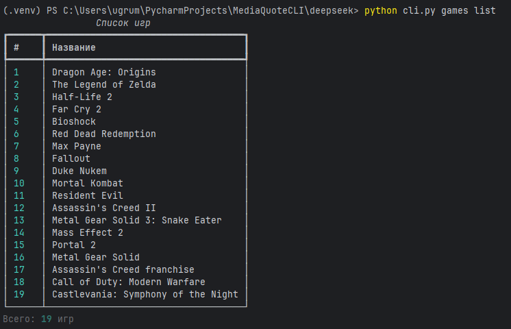
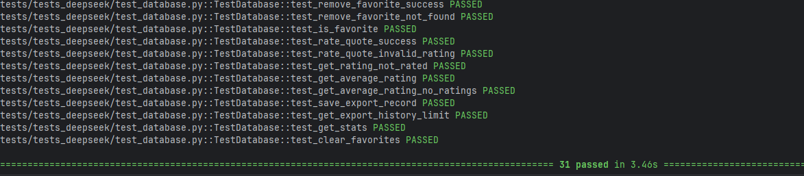
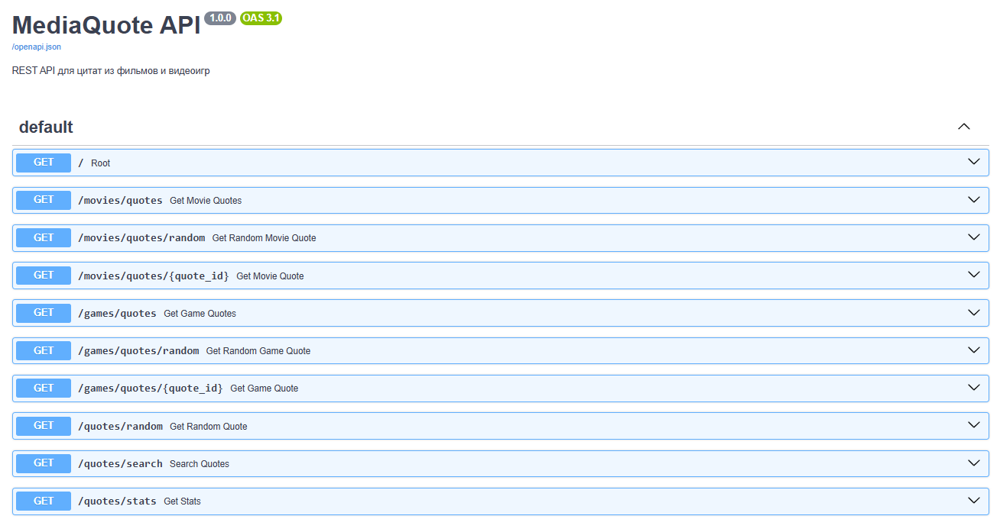

# MediaQuote CLI

Утилита командной строки для поиска, просмотра и управления цитатами из трёх источников: высказывания известных людей, цитаты из фильмов и цитаты из видеоигр.

Проект реализован в двух независимых версиях с использованием двух разных ИИ-инструментов для сравнения подходов к генерации кода.

---

## 1. Подробное описание проекта

Цитаты — это культурный контент, рассредоточенный по десяткам несовместимых API и сайтов. Хочешь найти цитату из Half-Life — идёшь на один ресурс. Хочешь любимую фразу Черчилля — на другой. Хочешь классику из «Крёстного отца» — на третий. Единого интерфейса не существует.

**MediaQuote CLI** решает это: единая утилита, которая объединяет несколько источников в один унифицированный формат и предоставляет богатый CLI-интерфейс для работы с цитатами — поиск, сохранение, фильтрация, оценка, избранное и экспорт.

Используемые источники данных:
- **[ZenQuotes](https://zenquotes.io/api)** — цитаты известных людей (внешний API, без ключа);
- **Собственный FastAPI сервер** (`mediaquote-api/`) — цитаты из фильмов (753 цитаты) и видеоигр (20 цитат).

Все источники приводятся к единой модели цитаты. Локальное хранилище на SQLite позволяет сохранять цитаты, добавлять их вручную, ставить оценки и вести список избранного без интернета.

---

## 2. Выбранные ИИ-инструменты

**Claude (Anthropic, Claude Sonnet 4.6)** — версия `claude/`. Коммерческая модель, ориентированная на точное следование инструкциям и работу с многофайловыми проектами.

**DeepSeek** — версия `deepseek/`. Бесплатная открытая модель. Сильный универсальный инструмент, широко охватывает разные области знаний. Бесплатность делает его доступным вариантом для учебных проектов.

---

## 3. Ожидания от сравнения

**Claude** ожидается более аккуратным в архитектурных решениях: меньше лишнего кода, чёткое следование структуре ТЗ, хорошая читаемость. Модель известна умением удерживать контекст длинного диалога.

**DeepSeek** ожидается быстрее на простых задачах, но склонным к избыточной архитектуре и игнорированию деталей ТЗ без явных ограничений в промпте.

---

## 4. Методология

Обе версии разрабатывались по одному ТЗ с одинаковым стартовым промптом. Каждая модель работала в отдельном диалоге независимо. Подробно — в [comparison.md](comparison.md).

Этапы разработки:
- подготовка ТЗ и архитектуры;
- реализация FastAPI сервера с датасетами;
- реализация API-клиента;
- разработка команд CLI;
- тестирование и документация.

---

## 5. Установка и использование

### Требования

- Python `3.10+`
- pip

### Шаг 1 — Запустить API сервер (обязательно для обеих версий)

```bash
cd mediaquote-api
pip install -r requirements.txt
uvicorn main:app --reload
```

Swagger документация: `http://localhost:8000/docs`

### Шаг 2 — Запустить CLI

**Версия Claude:**
```bash
cd claude
pip install -r requirements.txt
python cli.py --help
```

```bash
python cli.py quotes random
python cli.py quotes search "war"
python cli.py movies list --movie "Godfather"
python cli.py games list --game "Portal"
python cli.py movies random
python cli.py games random
python cli.py favorites list
python cli.py rate set <id> 5
python cli.py export quotes --format csv --output quotes.csv
python cli.py stats show
```

**Версия DeepSeek:**
```bash
cd deepseek
pip install -r requirements.txt
python cli.py --help
```

```bash
python cli.py quotes random
python cli.py quotes search "war"
python cli.py movies list
python cli.py games list
python cli.py movies quotes "Star Wars"
python cli.py games quotes "BioShock"
python cli.py favorites list
python cli.py rate set <id> 5
python cli.py export to-json quotes.json
python cli.py stats all
```

---

## 6. Описание API

### Внешний API

**ZenQuotes** (`https://zenquotes.io/api`) — без ключа:
- `GET /api/random` — случайная цитата
- `GET /api/quotes` — список из 50 цитат

### Собственный FastAPI сервер (`mediaquote-api/`)

Базовый URL: `http://localhost:8000`

| Метод | Эндпоинт | Описание |
|---|---|---|
| GET | `/movies/quotes` | Список фильмовых цитат с фильтрацией |
| GET | `/movies/quotes/random` | Случайная из фильма |
| GET | `/movies/quotes/{id}` | По ID |
| GET | `/games/quotes` | Список игровых цитат с фильтрацией |
| GET | `/games/quotes/random` | Случайная из игры |
| GET | `/games/quotes/{id}` | По ID |
| GET | `/quotes/random` | Случайная из любого источника |
| GET | `/quotes/search?q=` | Поиск по всем |
| GET | `/quotes/stats` | Статистика базы |

---

## 7. Инструкция по тестированию

### Версия Claude — 70 тестов

```bash
cd MediaQuoteCLI
pytest tests/tests_claude/ -v
```

Покрывает: storage (CRUD, favorites, ratings, stats), api_client (ZenQuotes + FastAPI моки через respx), CLI команды через CliRunner.

### Версия DeepSeek — 31 тест

```bash
cd MediaQuoteCLI
pytest tests/tests_deepseek/ -v
```

Покрывает: database (CRUD, ratings, export history, stats), api_client (HTTP моки через respx).

---

## 8. Скриншоты работы

### Claude — справка по CLI


### Claude — случайная цитата, с оценкой, сохранением и отметкой избранным


### Claude — поиск по ключевому слову


### Claude — цитаты из фильма


### Claude — тесты


### DeepSeek — справка по CLI


### DeepSeek — случайная цитата из фильма


### DeepSeek — список игр


### DeepSeek — тесты


### Swagger документация API


---

## Структура репозитория

```
MediaQuoteCLI/
├── claude/                    # версия Claude
│   ├── cli.py                 # точка входа
│   ├── requirements.txt
│   └── cli/
│       ├── main.py
│       ├── config.py
│       ├── storage.py
│       ├── api_client.py
│       ├── formatters.py
│       └── commands/
├── deepseek/                  # версия DeepSeek
│   ├── cli.py                 # точка входа
│   ├── api_client.py
│   ├── config.py
│   ├── database.py
│   └── cli/
│       ├── quotes.py
│       ├── movies.py
│       ├── games.py
│       ├── favorites.py
│       ├── rate.py
│       ├── export.py
│       └── stats.py
├── mediaquote-api/            # общий FastAPI сервер
│   ├── main.py
│   ├── data.py
│   ├── movie_quotes.txt
│   ├── db.json
│   └── requirements.txt
├── docs/
│   ├── mediaquote_tz.md
│   ├── claude/
│   │   └── reportClaude.md
│   └── deepseek/
│       └── reportDeepSeek.md
├── tests/
│   ├── tests_claude/
│   └── tests_deepseek/
├── .gitignore
├── README.md
└── comparison.md
```

---

## Ссылки

- [Техническое задание](docs/mediaquote_tz.md)
- [Сравнительный отчёт](comparison.md)
- [ZenQuotes API](https://zenquotes.io/api)